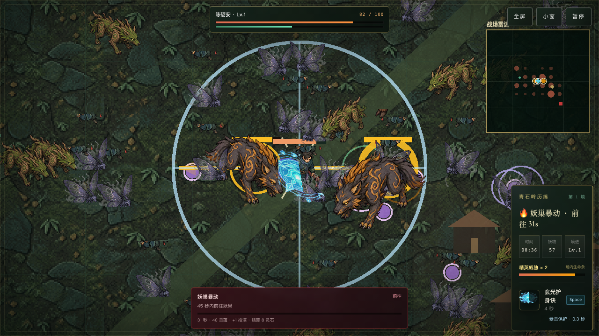

<h1 align="center">镇妖十刻</h1>

<p align="center">一介散修，御器镇妖。</p>

<p align="center">
  <a href="https://zhenyao.33338888.xyz"><strong>在线试玩</strong></a>
  ·
  <a href="https://github.com/gaoxiaoduan/zhenyao-shike/issues">反馈问题</a>
</p>

一款原创修仙题材的像素生存构筑游戏。在青石岭的妖潮中走位求生，收集灵蕴，搭配法器，从勉强求生到横扫妖群，最终迎战啸月狼王。



## 玩法

- **走位求生** — 法器自动攻击，专注躲避妖物与招式预警，在关键时刻施放玄光护身诀。
- **构筑成型** — 拾取灵蕴、升级三选一，四件基础法器自由搭配，探索三种高阶法器组合。
- **探索与决战** — 应对战场事件，经历约十分钟的生存与成长，再挑战啸月狼王。
- **再来一把** — 查看历练记录与个人最佳，尝试新的构筑；抵达妖王并结束该局后，可解锁妖王演练。

当前为首个可玩版本 **v0.1.0**，内容集中在青石岭的一局完整体验，后续仍会持续打磨。

## 开始游玩

[打开游戏](https://zhenyao.33338888.xyz)，即可免费开始历练，无需注册或下载。

| 操作 | 默认按键 |
| --- | --- |
| 移动 | `WASD` / 方向键 |
| 施放术法 | `Space` / `E` |
| 升级选卡 | `1` / `2` / `3` |
| 暂停 | `Esc` |

支持桌面键盘与移动端横屏触控；手机使用左侧摇杆移动、右侧按钮施术。桌面键位可在设置中修改。

设置、历练记录与妖王演练解锁状态保存在当前浏览器本地，清理浏览器数据会丢失记录，暂不支持跨设备同步。

## 本地运行

准备 Node.js **24** 和 pnpm：

```bash
git clone https://github.com/gaoxiaoduan/zhenyao-shike.git
cd zhenyao-shike
pnpm install
pnpm dev
```

打开终端显示的本地地址即可游玩。

使用 **Phaser 4 · Vue 3 · TypeScript · Vite** 构建，Vue 管理界面，Phaser 负责战场与战斗表现。

<details>
<summary>构建、测试与部署</summary>

```bash
pnpm build                    # 类型检查与生产构建
pnpm typecheck                # 单独检查类型
pnpm test:run                 # 单元与组件测试
pnpm exec playwright install  # 首次运行端到端测试前安装浏览器
pnpm test:e2e                 # Chromium、Firefox、WebKit 端到端测试
```

部署使用 Cloudflare Workers Static Assets。自行部署时，先修改 [wrangler.jsonc](wrangler.jsonc) 中的 Worker 名称与域名，并完成 Wrangler 登录：

```bash
pnpm exec wrangler login
pnpm run deploy:dry-run
pnpm run deploy
```

</details>

## 反馈与参与

欢迎试玩，也欢迎通过 [GitHub Issues](https://github.com/gaoxiaoduan/zhenyao-shike/issues) 分享建议、报告问题。反馈时附上浏览器、设备和复现步骤；截图或录像也很有帮助。
